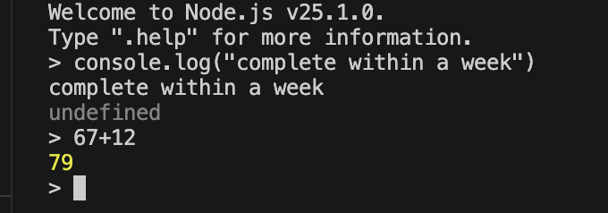

An interactive programming environment that repeatedly:

- Reads user input.

- Evaluates it.

- Prints the result.

- Loops back for more input.

Purpose

- Allows rapid prototyping and experimentation.

- Supports incremental development and debugging.

- Provides immediate feedback without compiling full programs.

- Node.js API access

- customizable

  
